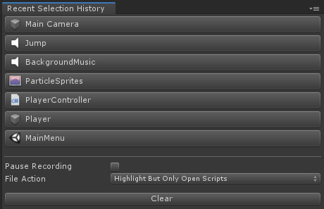

# **RecentSelectionHistory**

A Unity tool that keeps a history of recent selections. Reduces a lot of back and forth.
Selections can be GameObjects in a Scene or Project Assets, files and folders.

# How to Use

1. Open the Recent Selection History Window

* Window > Recent Selection History...

2. Select anything, GameObject in your Scene, a Project Asset File or Folder

3. Keep working, you can click on the recorded window items to go back and open that item in the Inspector and highlight it in the Hierarchy.
   In case you select a Project Asset file or folder, then clicking on the recorded item will launch that file or highlight that folder.
